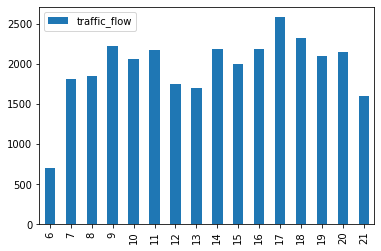
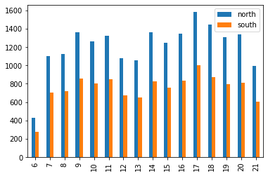
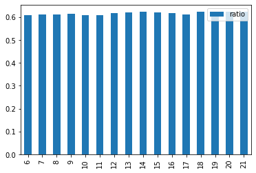
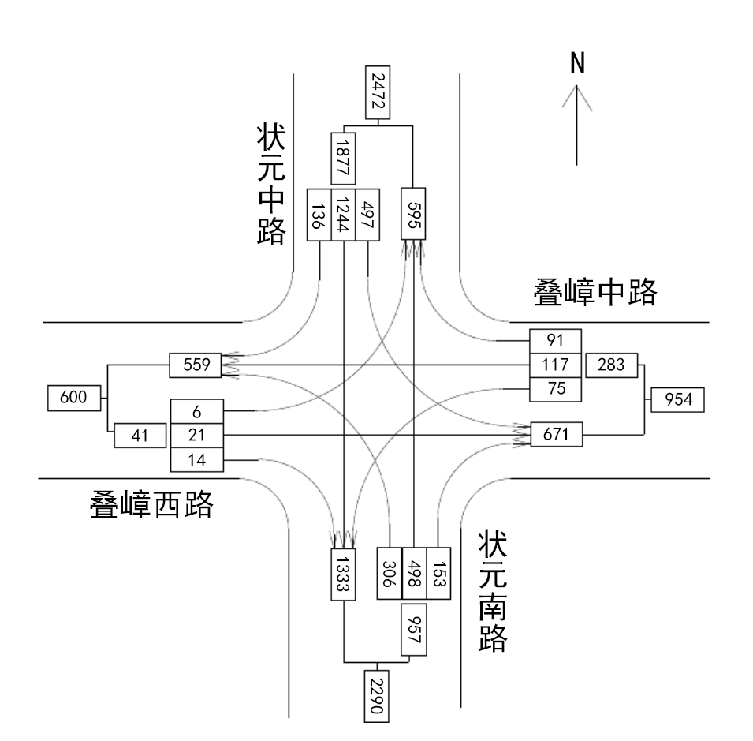
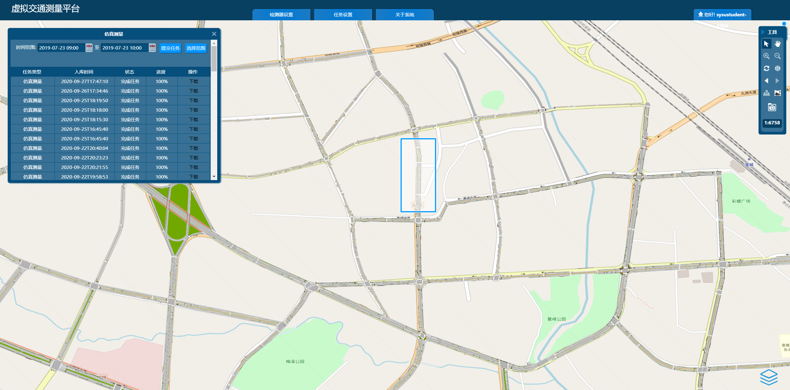

<link rel="stylesheet" href="https://cdnjs.cloudflare.com/ajax/libs/KaTeX/0.5.1/katex.min.css">

<link rel="stylesheet" href="https://cdn.jsdelivr.net/github-markdown-css/2.2.1/github-markdown.css"/>

## 一、实验目的
1.了解若干种交通量调查工具的工作原理；   
2.认识并掌握不同场景下交通量调查的观测手段与方法；  
3.认识并掌握不同类型观测数据的整理与处理方法；  
4.认识并掌握交通量时空变化与分布规律的研究与分析方法。   
## 二、实验内容
1.基于虚拟交通测量平台，开展路段交通量调查，统计、分析路段交通量特性；  
2.基于虚拟交通测量平台，开展交叉口交通量调查，统计、分析交叉口交通量特性；  
3.利用浮动车法调查原理，自主设计路段交通量调查方法，并基于虚拟交通测量平台开展实验。  
## 三、实验原理
### 1.交通量计数方法  
#### （1）机械计数法  
环形线圈车辆检测器是机械计数装置的典型代表。其基于电磁感应原理，可以获得观测路面交通流量、占有率、速度等数据。虚拟交通测量平台可模拟线圈检测路面交通量，其布设方法以及检测结果数据说明，详见《虚拟交通测量平台操作指南》。  
#### （2）浮动车法  
对于某个待测方向，根据测试车逆测定方向行驶时对向车辆数、顺测定方向行驶时的净超车数、两个方向的行驶时间、观测路段长度等信息，可同时获得某一路段的交通量、行驶时间和行驶车速，是一种较好的交通综合调查方法。实验者若充分理解浮动车法调查原理，即可基于虚拟交通测量平台开展相关实验。  
### 2.交通量特性
由于交通量具有时变性，为了说明代表性交通量，一般常用平均交通量、最大交通量、高峰小时交通量和从最大值算起第n位小时交通量之类的指标来刻画交通量特性。
为了刻画交通量的时间分布特性，常描绘交通量时变柱状图来分析交通量的时间变化规律；为了刻画交通量的空间分布分布特性，常利用方向不均匀系数（路段）和车辆流量流向图（交叉口）来分析交通量的空间变化规律。
### 3.浮动车GPS数据及其处理
首先要区分两个“浮动车”的概念。浮动车法交通量计数中的“浮动车”指的是实验测量车，而这里浮动车GPS数据中的“浮动车”指的是安装了车载GPS定位装置的车辆，它们通常是公交汽车和出租车。
虚拟交通测量平台可以模拟浮动车GPS数据的检测，其检测方法以及检测结果数据说明，详见《虚拟交通测量平台操作指南》。浮动车GPS数据经过处理，可以将车辆的位置数据和城市道路在时间和空间上关联起来，进而可以分析道路的时空状态。
## 四、专有名词介绍
1. 方向不均匀系数=主要行车方向交通量/双向交通量。  
2. 白天16小时交通量系数K16=白天16小时交通量/全天24小时交通量。  
3. 高峰小时流量比=高峰小时交通量/该日交通量。  
4. 高峰小时系数（PHF）是指分析道路通行能力时，表示高峰小时内交通量不平衡的修正系数。计算方法为高峰小时交通量与高峰小时内高峰时段的交通量扩大为1小时的交通量之比。  

## 五、实验任务
**1.观测某一工作日“状元中路”（位于下图蓝色方框内）路段某一断面的交通量。要求描述测量场景，作以下分析计算，并说明。**


（1）给出交通量时变柱状图；

```python
# 答题代码区

import pandas as pd

north_sum = [0 for i in range(30)]
south_sum = [0 for i in range(30)]
north_datas = ['23812', '23813']
south_datas = ['23808', '23809']

for j in range(2):

    north = pd.read_csv('../../measurement/' + north_datas[j] + '/tab_ldt.csv')
    south = pd.read_csv('../../measurement/' + south_datas[j] + '/tab_ldt.csv')

    for i in north.index:
        if (north.LANEID[i] not in range(1, 4)):
            continue
        s = north.FROMTIME[i]
        s = s[11:13]
        north_sum[int(s)] += north.COUNT[i]

    for i in south.index:
        if (north.LANEID[i] not in range(1, 4)):
            continue
        s = south.FROMTIME[i]
        s = s[11:13]
        south_sum[int(s)] += south.COUNT[i]

hours = range(6, 22)
flow_chart = pd.DataFrame(index=hours, columns=['traffic_flow'])
for i in hours:
    flow_chart.traffic_flow[i] = north_sum[i] + south_sum[i]

flow_chart.plot.bar()

```




**答题文字区**

依题意，求交通量，故应用线圈检测器数据。

设置如下：

- 日期：7月23日（周二）
- 位置：状元中路
- 检测器：线圈检测器
- 漏检率：5.0%
- 统计间隔：60秒

数据点

- 北向：
    - 23812（6-14）
    - 23813（14-22）
- 南向：
    - 23808（6-14）
    - 23809（14-22）

---

（2）给出6~22小时每小时的双向交通量和方向不均匀系数，画图体现；

```python
# 答题代码区

import pandas as pd

north_sum = [0 for i in range(30)]
south_sum = [0 for i in range(30)]
north_datas = ['23812', '23813']
south_datas = ['23808', '23809']

for j in range(2):

    north = pd.read_csv('../../measurement/' + north_datas[j] + '/tab_ldt.csv')
    south = pd.read_csv('../../measurement/' + south_datas[j] + '/tab_ldt.csv')

    for i in north.index:
        if (north.LANEID[i] not in range(1, 4)):
            continue
        s = north.FROMTIME[i]
        s = s[11:13]
        north_sum[int(s)] += north.COUNT[i]

    for i in south.index:
        if (north.LANEID[i] not in range(1, 4)):
            continue
        s = south.FROMTIME[i]
        s = s[11:13]
        south_sum[int(s)] += south.COUNT[i]

hours = range(6, 22)
flow_chart = pd.DataFrame(index=hours, columns=['north', 'south'])
ratio_chart = pd.DataFrame(index=hours, columns=['ratio'])
for i in hours:
    flow_chart.north[i] = north_sum[i]
    flow_chart.south[i] = south_sum[i]
    ratio_chart.ratio[i] = flow_chart.north[i] / (flow_chart.north[i] +
                                                  flow_chart.south[i])

flow_chart.plot.bar()
ratio_chart.plot.bar()

```





**答题文字区**

依题意，求交通量，故应用线圈检测器数据。

设置如下：

- 日期：7月23日（周二）
- 位置：状元中路
- 检测器：线圈检测器
- 漏检率：5.0%
- 统计间隔：60秒

数据点

- 北向：
    - 23812（6-14）
    - 23813（14-22）

- 南向：
    - 23808（6-14）
    - 23809（14-22）

---

（3）给出白天16小时交通量系数、高峰小时流量比，时间跨度为5分钟和15分钟的高峰区间（区间边界取整数分钟）及对应的高峰小时系数。

```python
# 答题代码区

import pandas as pd
import re

sum_ = [0 for i in range(30)]
datas = ['23810', '23811', '23892', '23893']

for j in datas:
    double = pd.read_csv('../../measurement/' + j + '/tab_ldt.csv')
    for i in double.index:
        if (double.LANEID[i] not in range(1, 4)):
            continue
        s = double.FROMTIME[i]
        s = s[11:13]
        sum_[int(s)] += double.COUNT[i]

ans = pd.DataFrame(
    index=['ANSWER'],
    columns=['K16', '高峰小时流量比', '五分钟高峰区间', '十五分钟高峰区间', 'PHF5', 'PHF15'])

t16 = 0
t24 = 0
sum_max = 0
max_hour = -1
for i in range(6, 22):
    t16 += sum_[i]
for i in range(24):
    t24 += sum_[i]
    if (sum_[i] > sum_max):
        sum_max = sum_[i]
        max_hour = i

ans.K16 = str(round(t16 / t24 * 100, 2)) + '%'
ans.高峰小时流量比 = str(round(sum_max / t24 * 100, 2)) + '%'

minute_sum = [0 for i in range(100)]
minute_flow = [0 for i in range(100)]
double = pd.read_csv('../../measurement/23811/tab_ldt.csv')
for i in double.index:
    if (double.LANEID[i] not in range(1, 4)):
        continue
    if (re.search('2019-07-23 17', double.FROMTIME[i])):
        s = double.FROMTIME[i]
        s = s[14:16]
        minute_sum[int(s)] += double.COUNT[i]

for i in range(60):
    minute_flow[i] = minute_sum[i]

max_flow5 = 0
max_min5 = -1
for i in range(56):
    t5 = 0
    for j in range(5):
        t5 += minute_flow[i + j]
    if (t5 > max_flow5):
        max_flow5 = t5
        max_min5 = i

max_flow15 = 0
max_min15 = -1
for i in range(46):
    t15 = 0
    for j in range(15):
        t15 += minute_flow[i + j]
    if (t15 > max_flow15):
        max_flow15 = t15
        max_min15 = i

ans.五分钟高峰区间 = '(' + str(max_min5) + ',' + str(max_min5 + 5) + ')'
ans.十五分钟高峰区间 = '(' + str(max_min15) + ',' + str(max_min15 + 15) + ')'
ans.PHF5 = str(
    round(100 * sum_[max_hour] /
          (max_flow5 * 12), 2)) + '%'
ans.PHF15 = str(
    round(100 * sum_[max_hour] /
          (max_flow15 * 4), 2)) + '%'

ans

```

|    K16 | 高峰小时流量比 | 五分钟高峰区间 | 十五分钟高峰区间 |  PHF5 |PHF15 |
| -----: | ----------: | -----------: | ------------: | ----: | ----: |
| 94.29% |        7.72% |     (43,48) | (30,45) | 80.88% | 90.92% |

**答题文字区**

除白天6-22点的数据之外，还需要测量0-6点，22-24点的数据。

数据点：

- 23810（6-14）
- 23811（14-22）
- 23892（0-6）
- 23893（22-24）

注：0-3时没有数据，更换时间地点仍无法得到有效数据，经检查并非操作失误，故保留结果。

---

**2. 观测某一工作日“叠嶂路与状元路”交叉口（位于下图蓝色方框内）的交通量。要求描述测量场景，作以下分析计算，并说明。**


（1）给出这个交叉口一天之中流入交通量最大小时；

```python
# 答题代码区

import pandas as pd

sum_ = [0 for i in range(30)]

datas = [
    '23992', '23993', '23994', '23995', '23998', '23999', '24000', '24001'
]

for j in datas:
    flow = pd.read_csv('../../measurement/' + j + '/tab_ldt.csv')
    for i in flow.index:
        if (flow.LANEID[i] not in range(1, 4)):
            continue
        s = flow.FROMTIME[i]
        s = s[11:13]
        sum_[int(s)] += flow.COUNT[i]

flowin_max = 0
max_hour = -1
for i in range(24):
    if (sum_[i] > flowin_max):
        flowin_max = sum_[i]
        max_hour = i

print('这个交叉口一天之中流入交通量最大小时为', max_hour, '时。')

```

这个交叉口一天之中流入交通量最大小时为 17 时。

**答题文字区**

数据点：

- 南向进入：
  - 23992（0-12）
  - 23993（12-24）
- 东向进入：
  - 23994（0-12）
  - 23995（12-24）
- 西向进入：
  - 23998（0-12）
  - 23999（12-24）
- 北向进入：
  - 24000（0-12）
  - 24001（12-24）

---

（2）画出该小时所对应的交叉口车辆流量流向图。

```python
# 答题代码区

import pandas as pd
import re

south_sum = [0, 0, 0, 0]
east_sum = [0, 0, 0, 0]
west_sum = [0, 0, 0, 0]
north_sum = [0, 0, 0, 0]

flow = pd.read_csv('../../measurement/23993/tab_ldt.csv')
for i in flow.index:
    if (flow.LANEID[i] not in range(1, 4)):
        continue
    if (re.search('2019-07-23 17', flow.FROMTIME[i])):
        south_sum[flow.LANEID[i]] += flow.COUNT[i]

flow = pd.read_csv('../../measurement/23995/tab_ldt.csv')
for i in flow.index:
    if (flow.LANEID[i] not in range(1, 4)):
        continue
    if (re.search('2019-07-23 17', flow.FROMTIME[i])):
        east_sum[flow.LANEID[i]] += flow.COUNT[i]

flow = pd.read_csv('../../measurement/23999/tab_ldt.csv')
for i in flow.index:
    if (flow.LANEID[i] not in range(1, 4)):
        continue
    if (re.search('2019-07-23 17', flow.FROMTIME[i])):
        west_sum[flow.LANEID[i]] += flow.COUNT[i]

flow = pd.read_csv('../../measurement/24001/tab_ldt.csv')
for i in flow.index:
    if (flow.LANEID[i] not in range(1, 4)):
        continue
    if (re.search('2019-07-23 17', flow.FROMTIME[i])):
        north_sum[flow.LANEID[i]] += flow.COUNT[i]

crossing = pd.DataFrame(index=[1, 2, 3],
                        columns=['south', 'east', 'west', 'north'])
for i in range(1, 4):
    crossing.south[i] = (south_sum[i])
for i in range(1, 4):
    crossing.east[i] = (east_sum[i])
for i in range(1, 4):
    crossing.west[i] = (west_sum[i])
for i in range(1, 4):
    crossing.north[i] = (north_sum[i])

crossing

```

**答题文字区**

17时对应的数据点：

- 南向进入：23993
- 东向进入：23995
- 西向进入：23999
- 北向进入：24001

由程序运行得出的流量表可画出下图：

注：流量表仅根据1-3车道数据判断转向情况（1为左转，2为直行，3为右转），如存在车道可多方向行驶（"SR", "SL"），则所得结果有偏差。



---

**3. 使用虚拟交通测量平台，利用浮动车法调查原理，设计实验：调查“状元中路”路段的交通量、平均行程时间、平均车速。只需调查一次（一个来回），要求：**

（1）描述调查的时空场景；

**答题文字区**

- 日期：2019年7月23日
- 时段：9:00-10:00
- 范围：状元中路
- 道路：南北双向四车道
- 路长：0.44km
- 数据点：24853
- 采样间隔：1s
- 渗透率：100%



---

（2）展示调查过程及其结果记录数据；

首先，选定一辆车，按每秒观察它在状元中路的行驶情况（时间点，速度，位置，方向），如果合适，则可作为测试车。

```python

import pandas as pd
import numpy as np
import re

flow = pd.read_csv('../../measurement/24853/tab_fcd.csv')
car_ID = 'b6a9b17c184a06db02dcb98c4bb5f84e'

for i in flow.index:
    if(flow.TRAVELID[i] == car_ID):
        print(flow.sj[i], flow.speed[i], flow.posm[i], flow.ftnode[i])

```

```
2019-07-23 09:50:46 28.2766281536206 495.84099268835996 4806_4927
2019-07-23 09:50:47 28.2766281536206 488.64523288333703 4806_4927
2019-07-23 09:50:48 28.2766281536206 482.91136106329805 4806_4927
2019-07-23 09:50:49 28.2766281536206 477.177489243258 4806_4927
2019-07-23 09:50:50 28.2766281536206 464.422516962115 4806_4927
2019-07-23 09:50:52 28.2766281536206 451.619778003852 4806_4927
2019-07-23 09:50:53 28.2766281536206 437.981066723534 4806_4927
2019-07-23 09:50:54 28.2766281536206 433.00404123587003 4806_4927
2019-07-23 09:50:56 28.2766281536206 417.29480337274805 4806_4927
2019-07-23 09:50:57 28.2766281536206 409.440184441186 4806_4927
2019-07-23 09:50:58 28.2766281536206 401.58556550962504 4806_4927
2019-07-23 09:51:00 28.2766281536206 385.876327646503 4806_4927
2019-07-23 09:51:01 28.2766281536206 378.02170871494104 4806_4927
2019-07-23 09:51:02 28.2766281536206 370.16708978338 4806_4927
2019-07-23 09:51:04 28.2766281536206 354.45785192025704 4806_4927
2019-07-23 09:51:05 28.2766281536206 346.603232988696 4806_4927
2019-07-23 09:51:06 28.2766281536206 338.748614057135 4806_4927
2019-07-23 09:51:08 28.2766281536206 323.039376194012 4806_4927
2019-07-23 09:51:09 28.2766281536206 315.184757262451 4806_4927
2019-07-23 09:51:10 28.2766281536206 307.33013833089 4806_4927
2019-07-23 09:51:12 28.2766281536206 291.620900467767 4806_4927
2019-07-23 09:51:13 28.2766281536206 283.766281536206 4806_4927
2019-07-23 09:51:14 28.2766281536206 275.911662604645 4806_4927
2019-07-23 09:51:16 28.2766281536206 260.202424741522 4806_4927
2019-07-23 09:51:17 28.2766281536206 252.34780580996102 4806_4927
2019-07-23 09:51:18 28.2766281536206 244.4931868784 4806_4927
2019-07-23 09:51:20 28.2766281536206 228.783949015277 4806_4927
2019-07-23 09:51:21 28.2766281536206 220.92933008371602 4806_4927
2019-07-23 09:51:22 28.2766281536206 213.074711152154 4806_4927
2019-07-23 09:51:23 28.2766281536206 205.220092220593 4806_4927
2019-07-23 09:51:25 28.2766281536206 189.510854357471 4806_4927
2019-07-23 09:51:26 28.2766281536206 181.65623542590902 4806_4927
2019-07-23 09:51:27 28.2766281536206 173.801616494348 4806_4927
2019-07-23 09:51:29 28.2766281536206 158.092378631226 4806_4927
2019-07-23 09:51:30 28.2766281536206 150.237759699664 4806_4927
2019-07-23 09:51:31 28.2766281536206 142.383140768103 4806_4927
2019-07-23 09:51:32 28.2766281536206 134.52852183654198 4806_4927
2019-07-23 09:51:33 28.2766281536206 126.67390290498001 4806_4927
2019-07-23 09:51:34 28.2766281536206 118.819283973419 4806_4927
2019-07-23 09:51:36 28.2766281536206 103.11004611029699 4806_4927
2019-07-23 09:51:37 28.2766281536206 95.25542717873529 4806_4927
2019-07-23 09:51:38 28.2766281536206 87.400808247174 4806_4927
2019-07-23 09:51:39 28.2766281536206 79.54618931561279 4806_4927
2019-07-23 09:51:40 28.2766281536206 71.6915703840515 4806_4927
2019-07-23 09:51:42 28.2766281536206 55.9823325209289 4806_4927
2019-07-23 09:51:43 28.2766281536206 48.1277135893677 4806_4927
2019-07-23 09:51:11 28.2766281536206 299.475519399329 4806_4927
2019-07-23 09:51:15 28.2766281536206 268.057043673083 4806_4927
2019-07-23 09:51:19 28.2766281536206 236.638567946838 4806_4927
2019-07-23 09:51:35 28.2766281536206 110.96466504185801 4806_4927
2019-07-23 09:50:51 28.2766281536206 456.567898030554 4806_4927
2019-07-23 09:50:55 28.2766281536206 425.149422304309 4806_4927
2019-07-23 09:50:59 28.2766281536206 393.730946578064 4806_4927
2019-07-23 09:51:03 28.2766281536206 362.312470851819 4806_4927
2019-07-23 09:51:07 28.2766281536206 330.893995125574 4806_4927
2019-07-23 09:51:24 28.2766281536206 197.365473289032 4806_4927
2019-07-23 09:51:28 28.2766281536206 165.946997562787 4806_4927
2019-07-23 09:51:41 28.2766281536206 63.836951452490204 4806_4927
```

该车“b6a9b”（TRAVELID前五位，下同）作为测试车合适。下面，给出该车在该路段行驶的时间范围。

```python
import pandas as pd
import numpy as np
import re

flow = pd.read_csv('../../measurement/24853/tab_fcd.csv')
car_ID = 'b6a9b17c184a06db02dcb98c4bb5f84e'
earlist = 9999
latest = 0
for i in flow.index:
    if(flow.TRAVELID[i] == car_ID):
        s = flow.sj[i]
        t = int(s[14:16]+s[17:19])
        if(t < earlist):
            earlist = t
        if(t > latest):
            latest = t
print('行驶时间范围为', earlist, '-', latest, '（分钟+秒，下同）。')

```

```
行驶时间范围为 5046 - 5143 （分钟+秒，下同）。
```

逆测试路段行驶的时间范围为：9:50:46 - 9:51:43，

$$T_a=57\rm s=0.95min。$$

现在，为对向行驶的车辆进行计数（$X_a$）。

```python
import pandas as pd
import numpy as np
import re

flow = pd.read_csv('../../measurement/24853/tab_fcd.csv')
earlist = 5046
latest = 5143

Xa = set()
for i in flow.index:
    s = flow.sj[i]
    t = int(s[14:16]+s[17:19])
    if(t in range(earlist, latest+20) and flow.ftnode[i] == '4927_4806'):
        Xa.add(flow.TRAVELID[i])
print('时间范围内对向行驶的车辆有：',Xa)
print('\n一共有：',len(Xa),'辆。')

```

```
时间范围内对向行驶的车辆有： {'2ed266ce634691a5b6ff0274aea7a4c6', 'ce497d68ca986abbbcbbed6c51db50de', '8df6644779cadc74464c22cc576f7290', '8c7ac75ac9071152f50cd539d9673b23', 'b3d74c71ece8f53cfe801fa3ca6e0a4e'}

一共有： 5 辆。
```

由集合输出结果，

$$X_a=5。$$

接下来，找出对向5辆车进入该路段的时间，便于找一个合适的对向车，以模拟测试车掉头后的状态。

```python
import pandas as pd
import numpy as np
import re

flow = pd.read_csv('../../measurement/24853/tab_fcd.csv')
car_ID = ['b3d74c71ece8f53cfe801fa3ca6e0a4e', '8c7ac75ac9071152f50cd539d9673b23',
          '2ed266ce634691a5b6ff0274aea7a4c6', 'ce497d68ca986abbbcbbed6c51db50de', '8df6644779cadc74464c22cc576f7290']


for j in car_ID:
    from_time = 9999
    to_time = 0
    for i in flow.index:
        if(flow.TRAVELID[i] == j and flow.ftnode[i] == '4927_4806'):
            s = flow.sj[i]
            t = int(s[14:16]+s[17:19])
            if(t > 5000 and t < from_time):
                from_time = t
            if(t > 5000 and t > to_time):
                to_time = t
    print('驶入时间：', from_time, '，驶出时间：', to_time, '，车辆ID：', j[:5])

```

```
驶入时间： 5106 ，驶出时间： 5211 ，车辆ID： b3d74
驶入时间： 5119 ，驶出时间： 5225 ，车辆ID： 8c7ac
驶入时间： 5010 ，驶出时间： 5055 ，车辆ID： 2ed26
驶入时间： 5134 ，驶出时间： 5227 ，车辆ID： ce497
驶入时间： 5001 ，驶出时间： 5052 ，车辆ID： 8df66
```

由运行结果知，车"ce497"最晚驶入该路段且最晚驶出，即浮动车调头后，前面最近的一辆为该车。于是，我们可以利用该车行驶情况来模拟测试车调头后的行驶情况，假设测试车调头一直紧跟在该车后面（即两车中间不会有其他车辆），且跟着该车同时驶出调查范围，我们令车"ce497"驶出该路段时间近似为测试车驶出该路段时间（考虑驶入调查路段的时间差额（9s），加上9s作为补偿），即测试车顺测试路段的行驶时间为：9:51:43-9:52:36，

$$T_c=53\rm s=0.88min。$$

于是，接下来模拟调查$Y_c$（超越测试车的车辆数减去被测试车超越的车辆数）。

```python
import pandas as pd
import numpy as np
import re

flow = pd.read_csv('../../measurement/24853/tab_fcd.csv')
car_ID = ['b3d74c71ece8f53cfe801fa3ca6e0a4e', '8c7ac75ac9071152f50cd539d9673b23',
          '2ed266ce634691a5b6ff0274aea7a4c6', '8df6644779cadc74464c22cc576f7290']
test_ID = 'ce497d68ca986abbbcbbed6c51db50de'
earlist = 5134
latest = 5227
Yc = 0

position = [0. for i in range(300)]

for i in flow.index:
    if(flow.TRAVELID[i] == test_ID):
        s = flow.sj[i]
        t = int(s[14:16]+s[17:19])
        position[t-5000] = flow.posm[i]


for i in flow.index:
    s = flow.sj[i]
    t = int(s[14:16]+s[17:19])
    if(t in range(earlist, latest+1) and flow.ftnode[i] == '4927_4806'):
        if(flow.TRAVELID[i] in car_ID):
            if(position[t-5000] > 1 and flow.posm[i] > position[t-5000]):
                Ya += 1
                print(Ya)
        elif(position[t-5000] > 1 and flow.posm[i] < position[t-5000]):
            Ya -= 1
            print(Yc)

print(Yc)

```

```
0
```

由程序运行结果，

$$Y_c=0。$$

至此，浮动车调查所需数据已全部求得。

| $X_a$ | $Y_c$ | $T_a(\rm min)$ | $T_c(\rm min)$ | $l(\rm km)$ |
| :---: | :---: | :------------: | :------------: | :---------: |
|   5   |   0   |      0.95      |      0.88      |    0.44     |

---

（3）展示调查结果的计算分析过程。

**答题文字区**

$$q_c=\frac{X_a+Y_c}{t_a+t_c}=\frac{5+0}{0.95+0.88}=2.73\rm min^{-1}=163.93 h^{-1}$$
$$\bar t_c=t_c-\frac{Y_c}{q_c}=0.88-0=0.88\rm min$$
$$\bar v_c=\frac{l}{t_c}\times 60=\frac{0.44}{0.88}\times 60=30.00\rm km/h$$

注：怀疑浮动车数据有缺失，即使在渗透率100%的情况下，测出的车辆数仍然少得不正常，更换时间地点仍然无法得到正常数据，经检查并非操作失误，故保留结果。