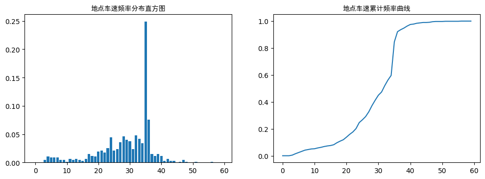
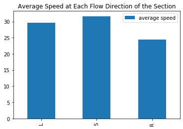
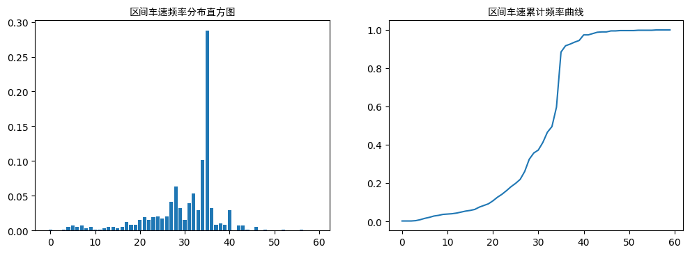
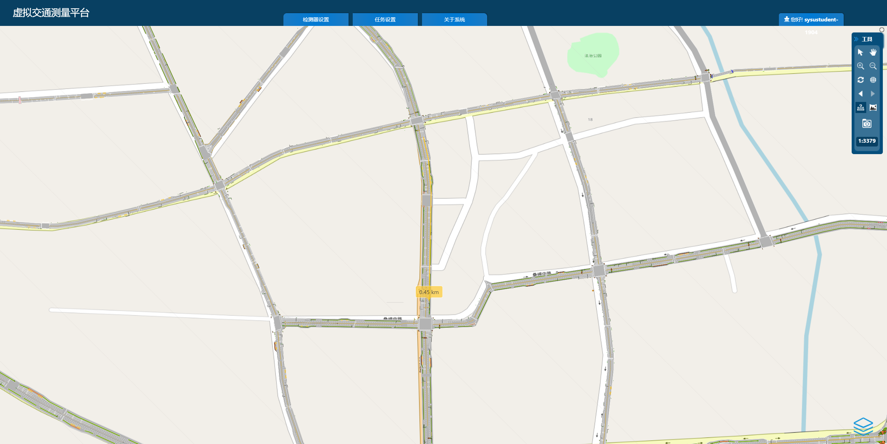
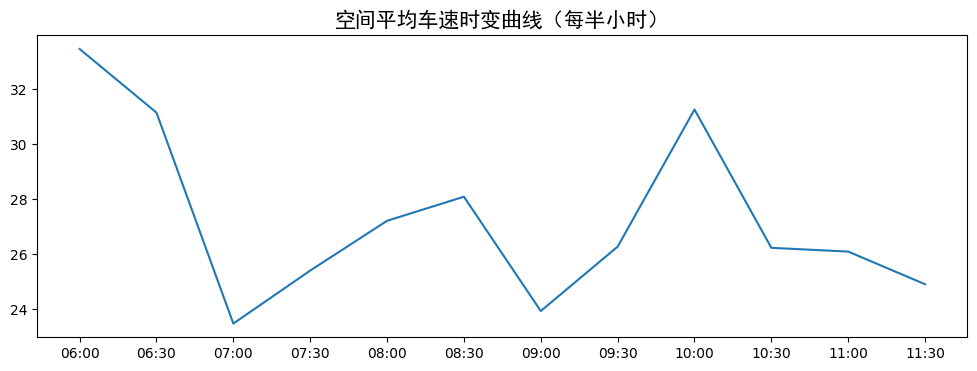

## 一、实验目的
1.	了解若干种交通速度调查方式的工作原理；
2.	认识不同场景下交通速度调查的方法，掌握具体调查方案设计；
3.	认识并掌握交通速度观测数据的处理、统计与分析方法。

## 二、实验内容
1.	基于虚拟交通测量平台，模拟车速调查设备的使用，开展两种最常规的路段交通速度调查——地点车速调查和区间车速调查；
2.	根据虚拟交通测量平台上的车速调查结果，统计各类、各情景的车速调查数据，分析车速分布规律、变化趋势等交通速度特性。

## 三、预备知识
### 1.	交通速度检测工具
虚拟测量平台提供了全域、全量、全时数据，平台用户可以可以利用线圈、卡口、GPS浮动车等测量方式获取车速调查数据。
#### （1）线圈检测方式
根据用户在虚拟交通测量平台设置的时间范围、空间位置、以及线圈装置的漏检率和统计间隔，可以输出虚拟线圈所在断面的平均车速数据。线圈的布设方法以及检测结果数据说明，详见《虚拟交通测量平台操作指南》。
#### （2）卡口检测方式
根据用户在虚拟交通测量平台设置的空间位置、以及卡口装置的漏检率和识别率，被虚拟卡口检测到的车辆，身份信息脱敏后的车道级车速数据。卡口的布设方法以及检测结果数据说明，详见《虚拟交通测量平台操作指南》。
#### （3）GPS浮动车数据分析方法
根据用户在虚拟交通测量平台设定的空间范围内所设置的浮动车渗透率及其GPS采样间隔，平台可输出该时空范围内GPS浮动车的瞬时速度等数据。其检测方法以及检测结果数据说明，详见《虚拟交通测量平台操作指南》。

### 2.	常见车速调查
#### （1）地点车速调查
地点车速，即断面上各车辆通过该断面地点时的车速。其通常使用自动计数器测量地点车速。这些计数器有电感式、环状线圈式和超声波式检测器，它们均设置在固定测站上，同时测得流量和流速。
#### （2）区间车速调查
区间车速，即在给定的路段上各车辆的平均行驶车速。其可使用汽车牌照号码登记法等方法测量区间车速。所谓汽车牌照号码登记法，即在调查路段的起终点设置观测点，记录通过观测点的车辆类型、牌照号码（后三位）、各辆车的到达时间。相同牌照号码通过起终点断面的时间差即为行程时间，路段距离除以行程时间即为行程车速。
	
### 3.	交通速度特性统计与分析
车速数据，可以整理为频率分布直方图和累计频率曲线，用以分析位置特征数（车速值的平均数、中位数、众数）和离散特征数（车速值的极差、标准差等）。
#### （1）车速频率分布直方图
第一步，对检测的速度数据进行适当分组，分组数应根据车速的分散程度和样本数量而定；   
第二步，确定每组的组中值，即分组的代表位，是一个分组的中心值；   
第三步，把现场观测值归入所属的组，统计得到各组的车速频数；   
第四步，将各组车速由小到大排列，绘制车速频率分布直方图。   
#### （2）车速累计频率曲线
第一步，对检测的速度数据进行适当分组，分组数应根据车速的分散程度和样本数量而定；   
第二步，确定每组的组中值，即分组的代表位，是一个分组的中心值；    
第三步，对于每个分组的中心值，统计小于或等于该中心值的累计频数；    
第四步，累计频率与累计频数相对应，即将累计频数除以样本量；    
第五步，以各车流分组中间值为横坐标，中间值对应的累计频率为纵坐标，连线得车速累计频率曲线。    

## 四、实验任务

**以“状元中路”路段（位于下图蓝色方框内）为交通调查对象，开展以下车速调查与分析实验。**


**1.	调查2019年7月1日08:00-10:00时段内“状元中路”路段南往北方向某一断面的地点车速，要求描述测量场景，作以下分析计算，并说明。**

（1）绘制地点车速频率分布直方图和累计频率曲线；

```python
# 答题代码区

import pandas as pd
import numpy as np
import matplotlib.pyplot as plt
import matplotlib.gridspec as gridspec
import matplotlib.font_manager as fm

data_point = '26912'
kk_df = pd.DataFrame(pd.read_csv(
    '../../measurement/'+data_point+'/tab_kk.csv'))

speed = [0 for i in range(60)]

for i in kk_df.loc[kk_df['LANEID'] != -1, 'SPEED']:
    i = int(round(i))
    if i in range(60):
        speed[i] += 1

sum_car = sum(speed)
for i in range(60):
    speed[i] /= sum_car


x = np.arange(60)
my_font = fm.FontProperties(fname='../font/simhei.ttf')
plt.figure(figsize=(12, 4), dpi=100)
gs = gridspec.GridSpec(2, 2)
ax1 = plt.subplot(gs[:, 0])
ax2 = plt.subplot(gs[:, 1])


ax1.set_title('地点车速频率分布直方图', fontproperties=my_font)
ax1.bar(x, speed)

for i in range(1, 60):
    speed[i] += speed[i-1]
ax2.set_title('地点车速累计频率曲线', fontproperties=my_font)
ax2.plot(x, speed)


plt.show()

```




（2）求其15%、50%、85%位车速以及平均车速；

```python
# 答题代码区

import pandas as pd

data_point = '26912'
kk_df = pd.DataFrame(pd.read_csv(
    '../../measurement/'+data_point+'/tab_kk.csv'))

speed_sr = kk_df.loc[kk_df['LANEID'] != -1, 'SPEED']
speed_sr = speed_sr.sort_values().reset_index()

sp15 = speed_sr.SPEED[int(0.15*len(speed_sr))]
sp50 = speed_sr.SPEED[int(0.50*len(speed_sr))]
sp85 = speed_sr.SPEED[int(0.85*len(speed_sr))]

print('15%%车速为%f\n50%%车速为%f\n85%%车速为%f\n平均车速为%f\n'
      % (sp15, sp50, sp85, round(sum(speed_sr.SPEED)/len(speed_sr), 3)))

```

```
15%车速为20.959110
50%车速为32.159913
85%车速为35.541289
平均车速为29.589000
```

（3）统计分析该断面各流向（左转、直行、右转）的地点平均车速，绘图表示。

```python
# 答题代码区

import pandas as pd
import matplotlib.pyplot as plt

data_point = '26912'
kk_df = pd.DataFrame(pd.read_csv(
    '../../measurement/'+data_point+'/tab_kk.csv'))

speed = [0 for i in range(60)]

l_speed_sr = kk_df.loc[(kk_df['LANEID'] != -1) &
                       (kk_df['TURN'] == 'L'), 'SPEED']
s_speed_sr = kk_df.loc[(kk_df['LANEID'] != -1) &
                       (kk_df['TURN'] == 'S'), 'SPEED']
r_speed_sr = kk_df.loc[(kk_df['LANEID'] != -1) &
                       (kk_df['TURN'] == 'R'), 'SPEED']


lsr_speed_df = pd.DataFrame(index=['L', 'S', 'R'], columns=['average speed'])
lsr_speed_df['average speed']['L'] = sum(l_speed_sr)/len(l_speed_sr)
lsr_speed_df['average speed']['S'] = sum(s_speed_sr)/len(s_speed_sr)
lsr_speed_df['average speed']['R'] = sum(r_speed_sr)/len(r_speed_sr)
my_font = fm.FontProperties(fname='../font/simhei.ttf')
lsr_speed_df.plot.bar(
    title='Average Speed at Each Flow Direction of the Section')

```



**2.	使用牌照号码登记法调查2019年7月1日08:00-10:00 时段内“状元中路”路段南往北方向的区间车速，要求自行设计调查方案，描述测量场景，作以下分析计算，并说明。**

（1）绘制区间车速频率分布直方图和累计频率曲线；

```python
# 答题代码区

import pandas as pd
import numpy as np
import matplotlib.pyplot as plt
import matplotlib.gridspec as gridspec
import matplotlib.font_manager as fm
import datetime

data_point = '27494'
kk_df = pd.DataFrame(pd.read_csv(
    '../../measurement/'+data_point+'/tab_kk.csv'))


time_df = kk_df.loc[(kk_df['LANEID'] != -1) &
                    (kk_df['DEVICEID'] == 1714), ['TRAVELID', 'SJ']]
to_time = {}
for i in time_df.index:
    to_time[time_df.TRAVELID[i]] = datetime.datetime.strptime(
        time_df.SJ[i], '%Y-%m-%d %H:%M:%S')


time_df = kk_df.loc[(kk_df['LANEID'] != -1) &
                    (kk_df['DEVICEID'] == 1713), ['TRAVELID', 'SJ']]
from_time = {}
for i in time_df.index:
    from_time[time_df.TRAVELID[i]] = datetime.datetime.strptime(
        time_df.SJ[i], '%Y-%m-%d %H:%M:%S')

speed = []

for i in from_time.keys():
    if i in to_time.keys():
        # if(to_time[i] < from_time[i]):
        #     print('###', i, from_time[i], to_time[i])
        speed.append(60*60*0.45/(to_time[i]-from_time[i]).seconds)


speed_count = [0. for i in range(60)]

for i in speed:
    i = int(round(i))
    if i in range(60):
        speed_count[i] += 1

sum_car = sum(speed_count)
for i in range(60):
    speed_count[i] /= sum_car


x = np.arange(60)
my_font = fm.FontProperties(fname='../font/simhei.ttf')
plt.figure(figsize=(12, 4), dpi=100)
gs = gridspec.GridSpec(2, 2)
ax1 = plt.subplot(gs[:, 0])
ax2 = plt.subplot(gs[:, 1])


ax1.set_title('区间车速频率分布直方图', fontproperties=my_font)
ax1.bar(x, speed_count)


for i in range(1, 60):
    speed_count[i] += speed_count[i-1]
ax2.set_title('区间车速累计频率曲线', fontproperties=my_font)
ax2.plot(x, speed_count)

```



卡口为：

- 1713（先）
- 1714（后）

距离如图，为0.45km。



（2）计算其平均车速、车速极差、车速标准差。

```python
# 答题代码区

import pandas as pd
import numpy as np
import datetime

data_point = '27494'
kk_df = pd.DataFrame(pd.read_csv(
    '../../measurement/'+data_point+'/tab_kk.csv'))


time_df = kk_df.loc[(kk_df['LANEID'] != -1) &
                    (kk_df['DEVICEID'] == 1714), ['TRAVELID', 'SJ']]
to_time = {}
for i in time_df.index:
    to_time[time_df.TRAVELID[i]] = datetime.datetime.strptime(
        time_df.SJ[i], '%Y-%m-%d %H:%M:%S')


time_df = kk_df.loc[(kk_df['LANEID'] != -1) &
                    (kk_df['DEVICEID'] == 1713), ['TRAVELID', 'SJ']]
from_time = {}
for i in time_df.index:
    from_time[time_df.TRAVELID[i]] = datetime.datetime.strptime(
        time_df.SJ[i], '%Y-%m-%d %H:%M:%S')

speed = []

for i in from_time.keys():
    if i in to_time.keys():
        v = 60*60*0.45/(to_time[i]-from_time[i]).seconds
        if(v > 1 and v <= 80):
            speed.append(v)

print('平均车速：%.2f\n车速极差：%.2f\n车速标准差：%.2f' %
      (np.mean(speed), max(speed)-min(speed), np.std(speed)))

```

```
平均车速：30.50
车速极差：53.05
车速标准差：7.74
```

**3.调查2019年7月1日06:00-12:00时段内“状元中路”北往南方向中间路段的空间平均车速，绘制空间平均车速的时变曲线。（提示：利用浮动车数据进行分析）**

```python
# 答题代码区

import pandas as pd
import matplotlib.pyplot as plt
import matplotlib.gridspec as gridspec
import matplotlib.font_manager as fm

time_dic = {}

data_point = ['27782', '27783', '27784']
for sample in data_point:
    fcd_df = pd.DataFrame(pd.read_csv(
        '../../measurement/'+sample+'/tab_fcd.csv'))
    fcd_df = fcd_df.loc[fcd_df['laneid'] != -1,  ("TRAVELID", "sj", "laneid")]
    fcd_df['sj'] = pd.to_datetime(fcd_df['sj'])
    for i in fcd_df.index:
        if(fcd_df.TRAVELID[i] in time_dic.keys()):
            in_out_time = time_dic[fcd_df.TRAVELID[i]]
            in_out_time[0] = min(fcd_df.sj[i], in_out_time[0])
            in_out_time[1] = max(fcd_df.sj[i], in_out_time[1])
            in_out_time[2] = (in_out_time[1]-in_out_time[0]).seconds
        else:
            time_dic[fcd_df.TRAVELID[i]] = [fcd_df.sj[i], fcd_df.sj[i], 0]


time_df = pd.DataFrame(time_dic)
time_df = time_df.T
speed_axis = []
time_axis = []

for h in range(6, 12):
    for m in range(0, 60, 30):
        frt = '2019-07-01 %02d:%02d:00' % (h, m)
        if(m == 30):
            tot = '2019-07-01 %02d:%02d:00' % (h+1, 0)
        else:
            tot = '2019-07-01 %02d:%02d:00' % (h, m+30)
        tmp_df = time_df.loc[(time_df[0] >= frt) & (
            time_df[0] < tot) & (time_df[2] < 360), [0, 1, 2]]
        speed_axis.append(60*60*0.45*len(tmp_df)/sum(tmp_df[2]))
        time_axis.append(frt[11:16])


simhei_font = fm.FontProperties(fname='../font/simhei.ttf')
plt.figure(figsize=(12, 4), dpi=100)
ax = plt.subplot()
ax.set_title('空间平均车速时变曲线（每半小时）', fontproperties=simhei_font, size=15)
ax.plot(time_axis, speed_axis)

```



