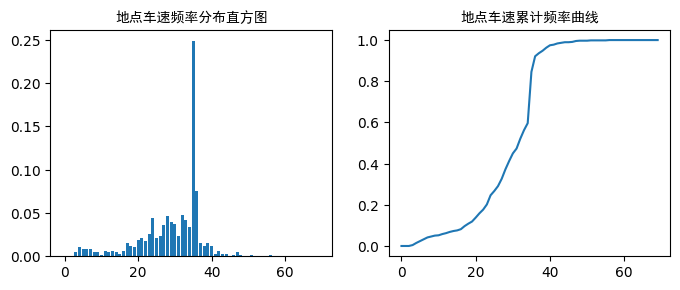
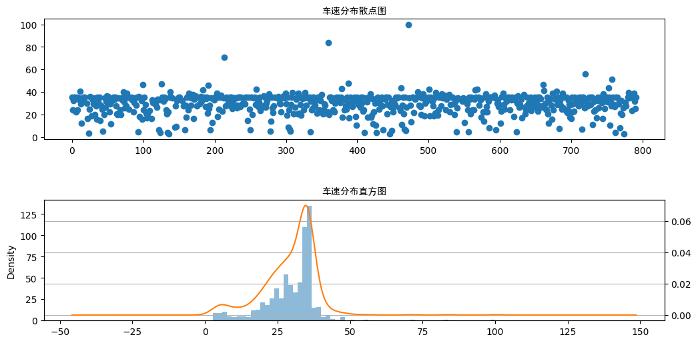
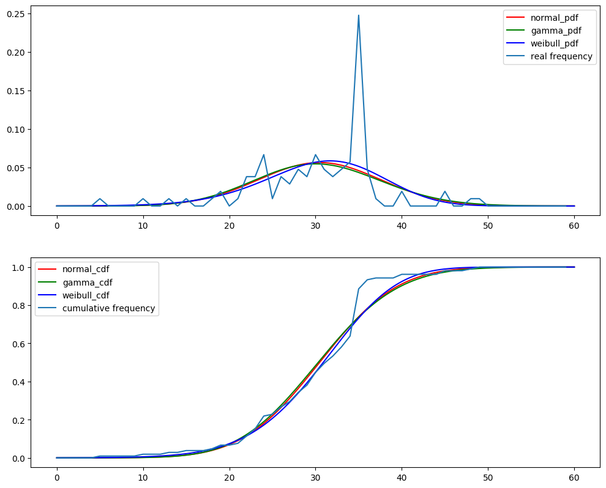

## 一、实验目的
1.	了解若干种交通速度调查方式的工作原理；
2.	认识不同场景下交通速度调查的方法，掌握具体调查方案设计；
3.	认识并掌握交通速度观测数据的处理、统计与分析方法。

## 二、实验内容
1.	基于虚拟交通测量平台，模拟车速调查设备的使用，开展两种最常规的路段交通速度调查——地点车速调查和区间车速调查；
2.	根据虚拟交通测量平台上的车速调查结果，统计各类、各情景的车速调查数据，分析车速分布规律、变化趋势等交通速度特性。

## 三、预备知识
### 1.	交通速度检测工具
虚拟测量平台提供了全域、全量、全时数据，平台用户可以可以利用线圈、卡口、GPS浮动车等测量方式获取车速调查数据。
#### （1）线圈检测方式
根据用户在虚拟交通测量平台设置的时间范围、空间位置、以及线圈装置的漏检率和统计间隔，可以输出虚拟线圈所在断面的平均车速数据。线圈的布设方法以及检测结果数据说明，详见《虚拟交通测量平台操作指南》。
#### （2）卡口检测方式
根据用户在虚拟交通测量平台设置的空间位置、以及卡口装置的漏检率和识别率，被虚拟卡口检测到的车辆，身份信息脱敏后的车道级车速数据。卡口的布设方法以及检测结果数据说明，详见《虚拟交通测量平台操作指南》。
#### （3）GPS浮动车数据分析方法
根据用户在虚拟交通测量平台设定的空间范围内所设置的浮动车渗透率及其GPS采样间隔，平台可输出该时空范围内GPS浮动车的瞬时速度等数据。其检测方法以及检测结果数据说明，详见《虚拟交通测量平台操作指南》。

### 2.	常见车速调查
#### （1）地点车速调查
地点车速，即断面上各车辆通过该断面地点时的车速。其通常使用自动计数器测量地点车速。这些计数器有电感式、环状线圈式和超声波式检测器，它们均设置在固定测站上，同时测得流量和流速。
#### （2）区间车速调查
区间车速，即在给定的路段上各车辆的平均行驶车速。其可使用汽车牌照号码登记法等方法测量区间车速。所谓汽车牌照号码登记法，即在调查路段的起终点设置观测点，记录通过观测点的车辆类型、牌照号码（后三位）、各辆车的到达时间。相同牌照号码通过起终点断面的时间差即为行程时间，路段距离除以行程时间即为行程车速。
	
### 3.	交通速度特性统计与分析
车速数据，可以整理为频率分布直方图和累计频率曲线，用以分析位置特征数（车速值的平均数、中位数、众数）和离散特征数（车速值的极差、标准差等）。
#### （1）车速频率分布直方图
第一步，对检测的速度数据进行适当分组，分组数应根据车速的分散程度和样本数量而定；
第二步，确定每组的组中值，即分组的代表位，是一个分组的中心值；
第三步，把现场观测值归入所属的组，统计得到各组的车速频数；
第四步，将各组车速由小到大排列，绘制车速频率分布直方图。
#### （2）车速累计频率曲线
第一步，对检测的速度数据进行适当分组，分组数应根据车速的分散程度和样本数量而定；
第二步，确定每组的组中值，即分组的代表位，是一个分组的中心值；
第三步，对于每个分组的中心值，统计小于或等于该中心值的累计频数；
第四步，累计频率与累计频数相对应，即将累计频数除以样本量；
第五步，以各车流分组中间值为横坐标，中间值对应的累计频率为纵坐标，连线得车速累计频率曲线。
## 四、提示
常用的车速分布模型有正态分布、威布尔分布、伽马分布等等。  

真实的总体速度的获取：使用漏检率为0% 的卡口设备，获取2019年7月1日08:00-08:20时段内“状元中路”路段南往北方向断面（断面距离上方路口约45米处，位于下图红线所在位置）的地点车速。  

相对熵具体度量过程如下：  

$$
KL(F||f)=\sum_{i=1}^{N}F_{i}\times log(\frac{F_{i}}{f_{i}})
$$

其中，N 为地点车速样本数据以及总体数据的分组组数；$f_i$为第 i 组的理论频率（由所假设总体速度分布计算）；$F_i$  为总体数据中第 i 组的频率（真实的总体速度分布计算）。

## 五、实验任务

### 1. 调查2019年7月1日08:00-10:00时段内“状元中路”路段南往北方向某一断面的实测地点车速样本（检测时长不低于20 min），试整理出：

#### （1）	该车速的频率分布表、频率分布直方图、累计频率曲线；

```python
# 答题代码区

import pandas as pd
import numpy as np
import matplotlib.pyplot as plt
import matplotlib.gridspec as gridspec
import matplotlib.font_manager as fm

data_point = '26912'
kk_df = pd.DataFrame(pd.read_csv(
    '../../measurement/'+data_point+'/tab_kk.csv'))

MAX_SPEED = 70
speed_axis = range(MAX_SPEED)
count = [0 for i in speed_axis]

for i in kk_df.loc[(kk_df['LANEID'] != -1)  # & ((kk_df['SPEED'] > 35.6) | (kk_df['SPEED'] < 35.))
                   , 'SPEED']:
    i = int(round(i))
    if i in speed_axis:
        count[i] += 1

sum_car = sum(count)
for i in speed_axis:
    count[i] /= sum_car

print('车速\t|\t频率')
for i in range(0, MAX_SPEED, 5):
    o = i+5
    print('%d-%d：\t|\t%.2f%%' % (i, o, 100*sum(count[i:o])))


simhei_font = fm.FontProperties(fname='../font/simhei.ttf')
plt.figure(figsize=(8, 3), dpi=100)
ax1 = plt.subplot(121)
ax2 = plt.subplot(122)


ax1.set_title('地点车速频率分布直方图', fontproperties=simhei_font)
ax1.bar(speed_axis, count)

for i in speed_axis[1:]:
    count[i] += count[i-1]
ax2.set_title('地点车速累计频率曲线', fontproperties=simhei_font)
ax2.plot(speed_axis, count)

plt.subplots_adjust(hspace=0.5)
plt.show()

```

```python
车速	|	频率
0-5：	|	1.48%
5-10：	|	3.56%
10-15：	|	2.23%
15-20：	|	4.60%
20-25：	|	12.76%
25-30：	|	16.62%
30-35：	|	18.40%
35-40：	|	36.65%
40-45：	|	2.67%
45-50：	|	0.74%
50-55：	|	0.15%
55-60：	|	0.15%
60-65：	|	0.00%
65-70：	|	0.00%
```



#### （2） 计算车速分布特征（平均车速、标准离差、85%地点车速、15%地点车速）；

```python
# 答题代码区

import pandas as pd
import numpy as np

data_point = '26912'
kk_df = pd.DataFrame(pd.read_csv(
    '../../measurement/'+data_point+'/tab_kk.csv'))

speed_sr = kk_df.loc[(kk_df['LANEID'] != -1)  # & ((kk_df['SPEED'] > 35.6) | (kk_df['SPEED'] < 35.))
                     , 'SPEED']
speed_sr = speed_sr.sort_values().reset_index(drop=True)

sp15 = speed_sr[int(0.15*len(speed_sr))]
sp85 = speed_sr[int(0.85*len(speed_sr))]

print('标准差为\t%.2f\n平均车速为\t%.2f\n15%%车速为\t%.2f\n85%%车速为\t%.2f\n'
      % (np.std(speed_sr), round(sum(speed_sr)/len(speed_sr), 3), sp15, sp85))

```

```
标准差为	9.32
平均车速为	29.59
15%车速为	20.96
85%车速为	35.54
```

#### （3） 检验该样本是否拟合正态分布，并简要分析原因。

```python
# 答题代码区
# 参考链接：https://blog.csdn.net/tszupup/article/details/108432814

import pandas as pd
import numpy as np
import scipy
import matplotlib.pyplot as plt
import matplotlib.gridspec as gridspec
import matplotlib.font_manager as fm

data_point = '26912'
kk_df = pd.DataFrame(pd.read_csv(
    '../../measurement/'+data_point+'/tab_kk.csv'))

speed_sr = kk_df.loc[(kk_df['LANEID'] != -1)  # &((kk_df['SPEED'] > 35.6) | (kk_df['SPEED'] < 35.))
                     , 'SPEED']
MAX_SPEED = 100
speed_axis = range(MAX_SPEED)
count = [0 for i in speed_axis]
for i in speed_sr:
    i = int(round(i))
    if i in speed_axis:
        count[i] += 1

sum_car = sum(count)
for i in speed_axis:
    count[i] /= sum_car


x = np.arange(MAX_SPEED)
simhei_font = fm.FontProperties(fname='../font/simhei.ttf')
plt.figure(figsize=(12, 6), dpi=100)
ax1 = plt.subplot(211)
ax2 = plt.subplot(212)


ax1.set_title('车速分布散点图', fontproperties=simhei_font)
ax1.scatter(speed_sr.index, speed_sr)
plt.grid()


ax2.set_title('车速分布直方图', fontproperties=simhei_font)
speed_sr.hist(bins=60, alpha=0.5, ax=ax2)
speed_sr.plot(kind='kde', secondary_y=True, ax=ax2)
plt.grid()

plt.subplots_adjust(hspace=0.5)
plt.show()

u = speed_sr.mean()
std = speed_sr.std()
print(scipy.stats.kstest(speed_sr, 'norm', (u, std)))
print(scipy.stats.normaltest(speed_sr))
print(scipy.stats.shapiro(speed_sr))

```



```
KstestResult(statistic=0.1637206694124166, pvalue=2.5193138907687377e-16)
NormaltestResult(statistic=108.32230718248351, pvalue=3.0068368344100993e-24)
(0.8592212796211243, 3.925467710979739e-24)
```

### 2. 使用漏检率为90% 的卡口设备，调查2019年7月1日09:00-12:00时段内“状元中路”路段南往北方向断面（断面距离上方路口约45米处，位于下图红线所在位置）的地点车速。 要求：


#### （1）	提出该时段、该地点的总体速度分布的假设（估计其中特征参数，给出该总体分布函数F及其密度函数f），并利用该车速样本检验该假设。给出详细的步骤和说明。

```python
# 答题代码区
# 参考链接：https://xercis.blog.csdn.net/article/details/105533840

import numpy as np
import pandas as pd
from scipy import stats
import matplotlib.pyplot as plt
import matplotlib.font_manager as fm

data_point = '29144'
kk_df = pd.DataFrame(pd.read_csv(
    '../../measurement/'+data_point+'/tab_kk.csv'))

speed_sr = kk_df.loc[(kk_df['LANEID'] != -1) & (kk_df['SPEED'] < 60), 'SPEED']
MAX_SPEED = 60
speed_axis = range(MAX_SPEED)
count = [0 for i in speed_axis]
for i in speed_sr:
    i = int(round(i))
    if i in speed_axis:
        count[i] += 1
sum_car = sum(count)
for i in speed_axis:
    count[i] /= sum_car


norm_loc, norm_scale = stats.norm.fit(speed_sr)
gama_a, gama_loc, gama_scale = stats.gamma.fit(speed_sr)
wbul_a, wbul_c, wbul_loc, wbul_scale = stats.exponweib.fit(speed_sr)

print('normal: %.2f %.2f'%stats.norm.fit(speed_sr))
print('gamma: %.2f %.2f %.2f'%stats.gamma.fit(speed_sr))
print('weibull: %.2f %.2f %.2f %.2f'%stats.exponweib.fit(speed_sr))

x = np.linspace(0, 60, 10000)
norm_pdf = stats.norm.pdf(x, loc=norm_loc, scale=norm_scale)
norm_cdf = stats.norm.cdf(x, loc=norm_loc, scale=norm_scale)
wbul_pdf = stats.exponweib.pdf(
    x, a=wbul_a, c=wbul_c, loc=wbul_loc, scale=wbul_scale)
wbul_cdf = stats.exponweib.cdf(
    x, a=wbul_a, c=wbul_c, loc=wbul_loc, scale=wbul_scale)
gama_pdf = stats.gamma.pdf(x, a=gama_a, loc=gama_loc, scale=gama_scale)
gama_cdf = stats.gamma.cdf(x, a=gama_a, loc=gama_loc, scale=gama_scale)


plt.figure(figsize=(12, 10), dpi=100)

plt.subplot(211)
plt.plot(x, norm_pdf, 'r', label='normal_pdf')
plt.plot(x, gama_pdf, 'g', label='gamma_pdf')
plt.plot(x, wbul_pdf, 'b', label='weibull_pdf')
plt.plot(speed_axis, count, label='real frequency')
plt.legend()

for i in range(1, 60):
    count[i] += count[i-1]
plt.subplot(212)
plt.plot(x, norm_cdf, 'r', label='normal_cdf')
plt.plot(x, gama_cdf, 'g', label='gamma_cdf')
plt.plot(x, wbul_cdf, 'b', label='weibull_cdf')
plt.plot(speed_axis, count, label='cumulative frequency')
plt.legend()

# plt.subplots_adjust(hspace=0.5)
plt.show()

```

```
normal: 30.47 7.07
gamma: 267.28 -88.97 0.45
weibull: 3.51 32.91 -341.56 366.38
```



$$f_{normal}(x)=\frac{1}{7.07\times\sqrt{2\pi}}exp[-\frac{(x-30.47)^2}{2\times 7.07^2}]$$

$$f_{gamma}(x)=\frac{\beta^\alpha}{\Gamma(\alpha)}x^{\alpha-1}e^{-\beta x},x>0$$

$$f_{weibull}(x)=\frac{k}{\lambda}(\frac{x}{\lambda})^{k-1}e^{-(x/\lambda)^k},x>0$$

利用 python 的 scipy.stats 库，可算出以上模型参数的拟合值，用程序画出三种模型的拟合情况，除了在车速为35-36处，其他位置基本符合。

#### （2） 对所假设的总体速度分布与真实的总体速度分布的差异性进行度量。度量方法采用相对熵（又被称为Kullback-Leibler散度）作为度量。

```python
# 答题代码区

import numpy as np
import pandas as pd
from scipy import stats
import matplotlib.pyplot as plt
import matplotlib.font_manager as fm

data_point = '29144'
kk_df = pd.DataFrame(pd.read_csv(
    '../../measurement/'+data_point+'/tab_kk.csv'))

speed_sr = kk_df.loc[kk_df['LANEID'] != -1, 'SPEED']
count = [0 for i in range(100)]
MAX_SPEED = 100
speed_axis = range(MAX_SPEED)
for i in speed_sr:
    i = int(round(i))
    if i in speed_axis:
        count[i] += 1
sum_car = sum(count)
for i in speed_axis:
    count[i] /= sum_car


norm_loc, norm_scale = stats.norm.fit(speed_sr)
gama_a, gama_loc, gama_scale = stats.gamma.fit(speed_sr)
wbul_a, wbul_c, wbul_loc, wbul_scale = stats.exponweib.fit(speed_sr)


norm_pdf = stats.norm.pdf(speed_axis, loc=norm_loc, scale=norm_scale)
wbul_pdf = stats.exponweib.pdf(
    speed_axis, a=wbul_a, c=wbul_c, loc=wbul_loc, scale=wbul_scale)
gama_pdf = stats.gamma.pdf(
    speed_axis, a=gama_a, loc=gama_loc, scale=gama_scale)

KL_norm = 0
KL_wbul = 0
KL_gama = 0
for i in speed_axis:
    if (count[i] == 0):
        continue
    KL_norm += count[i] * np.log(count[i] / norm_pdf[i])
    KL_wbul += count[i] * np.log(count[i] / wbul_pdf[i])
    KL_gama += count[i] * np.log(count[i] / gama_pdf[i])

print('正态分布模型相对熵\t%.5f\n韦伯分布模型相对熵\t%.5f\n伽马分布模型相对熵\t%.5f\n' %
      (KL_norm/MAX_SPEED, KL_wbul/MAX_SPEED, KL_gama/MAX_SPEED))

```

```
正态分布模型相对熵	0.00714
韦伯分布模型相对熵	0.00678
伽马分布模型相对熵	0.00676
```

由三个分布模型的相对熵比较可知，假设的总体速度分布与真实的总体速度分布的差异性：

伽马分布模型 < 韦伯分布模型 < 正态分布模型

故伽马分布模型的拟合效果最好。